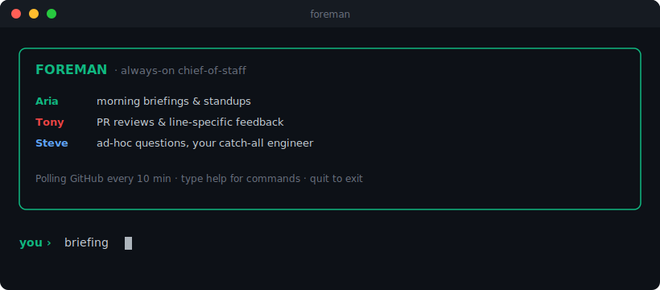
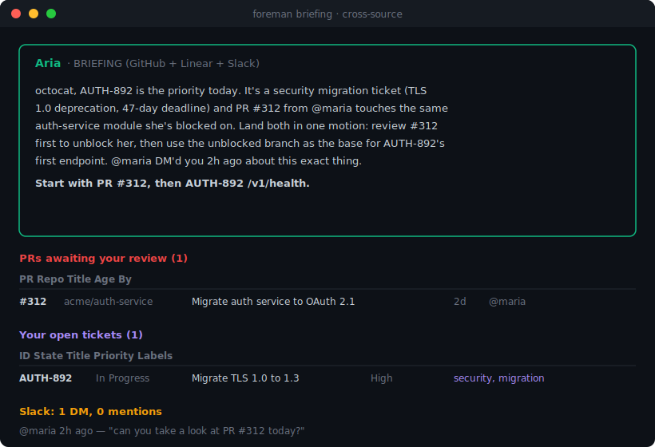
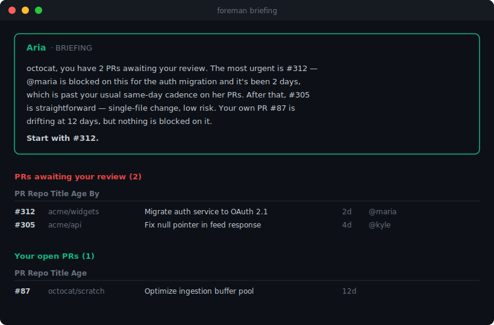
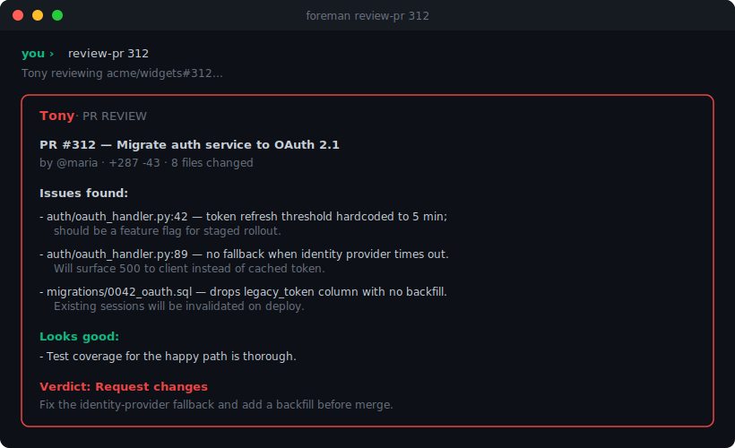
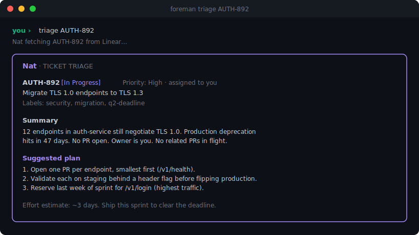
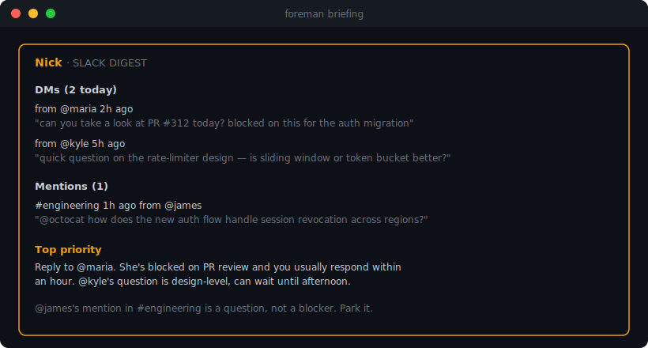
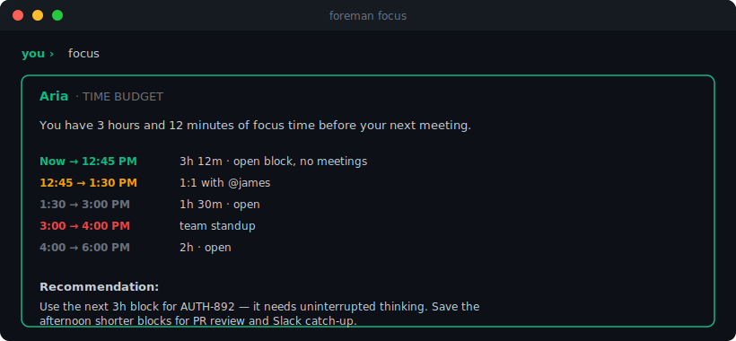
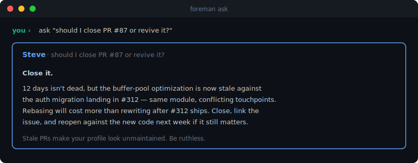

<div align="center">

# Foreman

**Your AI engineering chief-of-staff. Always on.**

A small team of specialized AI agents that synthesize signals across GitHub, Linear, Jira, Slack, Calendar, and Sentry, surface what actually matters today, and learn how you work over time. Morning briefings. Line-specific PR reviews. Ticket triage. Slack digests. Standup notes. Time-budget awareness. All from one terminal, all on your own machine.

[](https://pypi.org/project/foreman-cli/)
[](https://python.org)
[](LICENSE)
[](#roadmap)



</div>

## Why this exists

Senior engineers spend 30 to 60 minutes every morning reconstructing context across GitHub, Linear, Jira, and Slack: what changed overnight, what's blocked on me, what's urgent, what can wait, how much focus time I have before my first meeting. Existing tools either show you everything (notifiers) or show you nothing useful (digest emails). Neither learns your patterns.

Foreman is a small team of specialized AI agents. Each one owns a domain, shares a memory of how you work, and surfaces only the things you'd actually want surfaced. All from a single terminal.

It runs locally. Your data never leaves your machine.

## The morning briefing, across every source

Every time you start your day, ask once. Aria reads across GitHub, Linear, Jira, Slack, and your calendar, then tells you what actually matters today with a concrete first action. The narrative is generated each run from your real state. Cross-source synthesis is the moat.



If you only configure GitHub, you get a GitHub briefing. As you add Linear, Jira, and Slack, the synthesis gets sharper because Aria can spot connections (a Slack DM about a PR that touches a security ticket, all in one motion).



## Real PR reviews, not summaries

Tony reads the unified diff and produces a focused review with file:line references, prioritized by what actually breaks production. Bugs, missing error handling, security, breaking API changes, missing tests.



You stay in the loop. Tony tees up the context so you're not starting cold.

## Ticket triage with a real plan

Nat reads a Linear or Jira ticket and produces a structured triage: a summary, a concrete plan with verb-and-target steps, and an effort estimate. Security and migration tickets get escalated automatically.



## Slack digest, not Slack noise

Nick distinguishes "FYI ping" from "needs your input" from "blocking someone right now," learning over time which channels and senders you actually respond to. Real Slack OAuth, no cookie scraping.



## Time-budget awareness

Aria reads your calendar so the briefing isn't blind to your day. "You have 3 hours of focus before your 1:1, push deep work" beats "here are your PRs" every time.



## Ask anything

Steve has read access to your live state across every connector. Senior-engineer voice, no fluff. Gives a recommendation, not options.



## Meet the team

| Agent | Color | Domain |
|-------|-------|--------|
| **Aria** | 🟢 emerald | Daily briefings, standups, calendar awareness, cross-source synthesis |
| **Tony** | 🔴 red | PR reviews, GitHub Actions / CI status, line-specific feedback |
| **Nat** | 🟣 violet | Linear and Jira triage, Sentry production errors, security and migration escalation |
| **Nick** | 🟡 amber | Slack digests, DMs, mentions, urgency scoring |
| **Steve** | 🔵 blue | Catch-all questions, your fallback engineer |

Each agent has its own scoped tool set, its own memory namespace, and a clear domain it refuses to leave. They are not prompt-prefix personas. They're real specialized agents.

---

## Quick start

```bash
pip install foreman-cli
```

You'll need:

* **Anthropic API key**: [console.anthropic.com](https://console.anthropic.com/settings/keys). $5 lasts roughly 1000 briefings on Sonnet.
* **GitHub Personal Access Token**: [github.com/settings/personal-access-tokens/new](https://github.com/settings/personal-access-tokens/new) with `Contents: Read` and `Pull requests: Read`.
* **Linear API key** (optional but recommended): [linear.app/settings/account/security](https://linear.app/settings/account/security).

Create a `.env` in your working directory:

```bash
GITHUB_TOKEN=github_pat_...
GITHUB_USER=your-github-username
ANTHROPIC_API_KEY=sk-ant-...
LINEAR_API_KEY=lin_api_...
```

Then:

```bash
foreman doctor      # verify config + connectors
foreman run         # always-on REPL with background polling
```

Or use one-shot commands:

```bash
foreman briefing               # Aria's morning briefing across all configured sources
foreman standup                # standup notes from yesterday's activity
foreman review-pr 312          # Tony reviews a PR
foreman triage AUTH-892        # Nat triages a Linear ticket
foreman ask "..."              # Steve answers anything
foreman history                # recent agent activity
```

## Commands inside `foreman run`

```
briefing              Aria's morning briefing (cross-source)
standup               Aria's standup notes
review-pr <n>         Tony reviews PR #n (auto-detects repo)
triage <id>           Nat triages a Linear ticket (e.g. ABC-123)
history [n]           Recent agent activity (default 10)
help                  This list
quit / exit           Stop the daemon
<anything else>       Treated as a question for Steve
```

When `foreman run` is going, a background poller checks GitHub every 10 minutes. New PRs assigned to you surface inline plus as a macOS notification. First run silently registers your existing review queue so you don't get a notification storm.

## How it works

```
┌─────────────────────────────────────────────────────────────┐
│                       foreman process                       │
│                                                             │
│  ┌─────────┐ ┌─────────┐ ┌─────────┐ ┌─────────┐ ┌────────┐ │
│  │ GitHub  │ │ Linear  │ │  Jira   │ │  Slack  │ │  ...   │ │
│  └────┬────┘ └────┬────┘ └────┬────┘ └────┬────┘ └────┬───┘ │
│       └───────────┴───────────┴───────────┴───────────┘     │
│                            ▼                                │
│            ┌─────────────────────────────┐                  │
│            │    Event Bus (asyncio)      │                  │
│            └──────────────┬──────────────┘                  │
│                           ▼                                 │
│   ┌──────────────────────────────────────────────────┐      │
│   │  Prioritizer ◄── reads ── Memory (SQLite)        │      │
│   └──────────────────────────────────────────────────┘      │
│                           ▼                                 │
│            ┌────────┬─────────┬─────────┬─────────┐         │
│            │  Aria  │  Tony   │  Nat    │  Nick   │ Steve   │
│            └────┬───┴────┬────┴────┬────┴────┬────┴────┬────┘
│                 ▼        ▼         ▼         ▼         ▼    │
│            ┌─────────────────────────────────────────┐      │
│            │       Rich TUI + macOS Notifications    │      │
│            └─────────────────────────────────────────┘      │
└─────────────────────────────────────────────────────────────┘
```

See [`docs/architecture.md`](docs/architecture.md) for the full design rationale. Why SQLite (not JSONL queues), why specialized agents (not a megaprompt), why local-first (privacy plus zero procurement friction).

## Connectors

| Connector | Auth | Status |
|-----------|------|--------|
| GitHub | Personal Access Token | ✅ shipped |
| Linear | API key | ✅ shipped |
| Jira | API token + email | shipping in v0.7 |
| Slack | OAuth (real Slack app, no cookie scraping) | shipping in v0.8 |
| Google Calendar | OAuth | shipping in v0.9 |
| Sentry | Auth token | shipping in v0.9 |

Adding new connectors is a single file in `foreman/connectors/` plus registration. The architecture is intentionally pluggable.

## Privacy and local-first

* Your tokens (GitHub, Linear, Jira, Slack, Calendar, Sentry, Anthropic) live in `.env` on your machine. They never leave.
* All state (briefings, reviews, history) is stored in a single SQLite file at `~/Library/Application Support/foreman/foreman.db`.
* LLM calls go directly from your machine to Anthropic. No Foreman-operated server in the middle.
* No telemetry. No analytics. No "anonymous usage data."

## Contributing

Issues and PRs welcome. The architecture is intentionally pluggable. Adding a connector is one new file in `foreman/connectors/`. Adding an agent is one new file in `foreman/agents/` plus a versioned prompt in `foreman/llm/prompts/`.

If you're a senior engineer who wants Foreman to surface things it doesn't currently, open an issue describing the signal and how you'd want it framed. That drives the roadmap.

## License

MIT. See [LICENSE](LICENSE).
